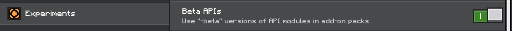

# Get Started

::: warning

`bedrock-stdhub` is still in active development. Please proceed with caution, and refer to [issues page](https://github.com/bedrock-stdhub/bedrock-stdhub/issues) for currently unfixed issues. We are not responsible for any loss caused by these issues.

:::

## Download the release

BDS currently supports Windows x64 and Linux x64 platforms. Download a suitable copy and put it at the same level as `bedrock_server` binary.

## Prepare the world

If you are going to work on a completely new world, then instead of letting BDS itself generate a world, you should generate a world in Minecraft game, turn on **beta APIs** trigger in 'Experiments' page (as is shown in the picture below), copy the world folder (usually under `C:\Users\YourUserName\AppData\Local\Packages\Microsoft.MinecraftUWP_8wekyb3d8bbwe\LocalState\games\com.mojang\minecraftWorlds`, sort by date to find the latest created world) to `path/to/bds/worlds` and rename the folder to `Bedrock level` (or whatever you've specified in your `server.properties`).


Or if you already have a world, please **back it up** first, since enabling experimental features may cause unexpected issues. Then copy the world to your Minecraft worlds folder, find it in your Minecraft client, enable beta APIs, and finally copy it back to `path/to/bds/worlds`.

::: details Don't you think the procedure above is a bit too complicated?

Yes, we hate long paths! We attempted to make bedrock-stdhub patch `level.dat` automatically, but we got stuck. See issue [#1](https://github.com/bedrock-stdhub/bedrock-stdhub/issues/1) for details.

:::

Now, the directory structure should be as follows:
```
|- bedrock_server[.exe]
|- bedrock-stdhub-[platform][.exe]
|- worlds
 |- Bedrock level
  |- level.dat
  |- ... other files
|- ... other files
```

## Install plugins

Download plugin files and put them in `plugins` folder (if the folder does not exist, create one first).

Plugins are distributed in the form of `mcaddon`. A `mcaddon` file is in fact a `zip` file of the following structure:
```
|- foo.mcaddon
 |- foo_bp.mcpack
 |- foo_rp.mcpack
```
In which two `mcpack`s are both `zip` files of certain structure. What bedrock-stdhub does is to unpack these plugin files to the world folder and automatically enable them.

After everything is ready, execute bedrock-stdhub.

## Plugin config and data

Many plugins have some options for users to configure. Generally, config files with default values will be created the first time a configurable plugin is loaded. Config files are in [YAML](https://yaml.org/) format and can be found in `plugins/[plugin-name]/`. The root config file name is `config.yaml`, and there may be some other sub config files.

Almost all plugins have some internal data to store. These data are serialized into JSON format and can be found in `plugins/[plugin-name]/data/`. You should not modify these files.

If you want to migrate a plugin to another server with its behavior keeping unchanged, remember to take the folder `plugins/[plugin-name]` along.
