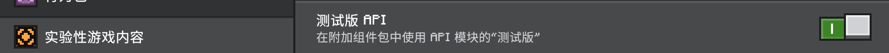

# 开始使用

::: warning 警告

`bedrock-stdhub` 仍然处于活跃开发阶段。请小心谨慎地继续，并参考 [issues 页](https://github.com/bedrock-stdhub/bedrock-stdhub/issues) 知晓尚未修复的问题。我们对因这些 issue 而造成的损失不负任何责任。

:::

## 下载 bedrock-stdhub

BDS 目前支持 Windows 64 位和 Linux 64 位平台。下载对应平台的 bedrock-stdhub，并将其与 `bedrock_server` 二进制文件放在同一目录下。

## 准备存档

如果你想在一个全新的存档上开服，那么不要让 BDS 本身生成世界，而是在 Minecraft 游戏中生成一个世界，并在“实验性游戏内容”页面中启用**测试版 API**（如下图），将生成的存档文件夹（通常在 `C:\用户\你的用户名\AppData\Local\Packages\Microsoft.MinecraftUWP_8wekyb3d8bbwe\LocalState\games\com.mojang\minecraftWorlds` 目录下，可以按日期排序来找到你刚刚创建的世界存档）复制到 `BDS 所在目录/worlds` 目录下，然后将存档文件夹重命名成 `Bedrock level`（或是你在 `server.properties` 中指定的其他值）。


或者，如果你已经有一个存档，请先将其**备份**，因为启用实验性游戏内容可能造成意料之外的问题。然后，将存档文件夹复制到 Minecraft 游戏的世界文件夹下，在 Minecraft 中找到这个世界，启用测试版 API，最后将存档复制回 `BDS 所在目录/worlds`。

::: details 不觉得上面的流程有点太繁琐了吗？

是的，长路径太烦人了！我们试图让 bedrock-stdhub 自动修补 `level.dat`，但现今遇到了困难。细节见 issue [#1](https://github.com/bedrock-stdhub/bedrock-stdhub/issues/1)。

:::

现在，你的目录结构应该如下：
```
|- bedrock_server[.exe]
|- bedrock-stdhub-[平台类型][.exe]
|- worlds
 |- Bedrock level
  |- level.dat
  |- ... 其他文件
|- ... 其他文件
```

## 安装插件

下载插件文件，并将其放在 `plugins` 文件夹下（如果 `plugins` 文件夹不存在，请先创建一个）。

插件以 `mcaddon` 的形式发布。一个 `.mcaddon` 文件实质上是一个具有如下结构的 `.zip` 文件：
```
|- foo.mcaddon
 |- foo_bp.mcpack
 |- foo_rp.mcpack
```
其中两个 `mcpack` 都是具有一定结构的 `zip` 文件。bedrock-stdhub 要做的是把 `plugins` 下的插件文件解压到存档目录下并且自动启用它们。

万事俱备，只欠启动。

## 插件配置与数据

许多插件都有一些可供用户配置的选项。一般情况下，一个可配置的插件在第一次启动时会生成具有默认值的配置文件。配置文件是 [YAML](https://yaml.org/) 格式的，位于 `plugins/[插件名称]` 目录下。主配置文件名是 `config.yaml`；同一目录下还可能存在其他配置文件。

几乎所有插件都需要储存一些内部数据。这些数据会被序列化为 JSON 格式，位于 `plugins/[插件名称]/data` 目录下。你不应该修改这些文件。

如果你想要将一个插件迁移到另一个服务端，并且希望保持插件行为不变，别忘了把 `plugins/[插件名称]` 文件夹里的东西也一块搬过去。
